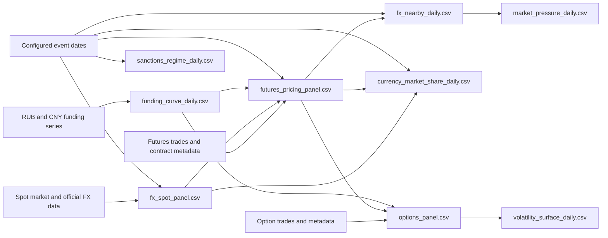

# Processed Data Dictionary

This document describes the processed CSV files in `data/processed/`. It covers the column lists supplied for the thesis dataset, including the two original CNY/RUB checkpoint files and the nine expanded research panels.

The descriptions reflect the transformations currently implemented in `src/collect_moex_data.py` and `src/build_research_panels.py`. Counts and date coverage refer to the files present in the repository on 2026-08-05; they can change when the collection pipeline is rerun.

## 1. Scope and conventions

- **Frequency:** daily observations on dates present in the underlying spot or futures data. The calendar is not a complete civil-day calendar.
- **Currency pairs:** `CNYRUB`, `USDRUB`, and `EURRUB`.
- **Quotation:** normalized FX prices are Russian rubles (RUB) per one unit of foreign currency. Thus a higher value means that the foreign currency is more expensive in RUB terms.
- **Raw versus normalized futures prices:** CNY/RUB raw prices already have the per-unit scale. USD/RUB (`Si`) and EUR/RUB (`Eu`) raw prices are quoted per 1,000 foreign-currency units and are divided by 1,000 in normalized columns.
- **Rates:** interest-rate fields ending in `_pct`, and named rate series such as `RUSFAR` and `SHIBOR_1W`, are annual percentage rates. A value of `18.0` means 18%, not 0.18.
- **Returns and implied volatility:** log returns and Black–76 implied volatilities are decimals. A volatility of `0.25` means 25% annualized.
- **Time to maturity:** calendar days with an Actual/365 year fraction.
- **Shares:** fields beginning with `share_` are fractions from 0 to 1, not percentages.
- **Missing values:** unavailable source observations and undefined calculations remain empty/NA. A missing value is not zero. Source-reported zeros are retained.
- **Flows and stocks:** daily volume and turnover are flows; open interest is an end-of-day stock.
- **As-of matching:** funding observations are joined backward only. No future rate observation is used.

## 2. Data flow



## 3. File inventory

| File | Status | Row grain and primary key | Rows | Columns | Current coverage | Purpose |
|---|---|---|---:|---:|---|---|
| `contract_daily.csv` | Legacy CNY-only checkpoint | One CNY/RUB futures contract-day; (`trade_date`, `secid`) | 6,042 | 48 | 2022-07-01 to 2026-07-17 | Original contract-level CNY/RUB pricing panel. |
| `nearby_daily.csv` | Legacy CNY-only checkpoint | One date; `trade_date` | 1,030 | 49 | 2022-07-01 to 2026-07-17 | Original nearest-expiry CNY/RUB series. |
| `fx_spot_panel.csv` | Current | One pair-day; (`pair`, `trade_date`) | 12,408 | 48 | 2013-01-08 to 2026-08-04 | Exchange and official-reference spot prices, returns, activity availability, and regimes. |
| `funding_curve_daily.csv` | Current | One date; `trade_date` | 5,128 | 79 | 2009-01-11 to 2026-08-04 | Backward-as-of RUB and CNY funding, repo, and policy-rate observations. |
| `futures_pricing_panel.csv` | Current | One pair-contract-day; (`pair`, `secid`, `trade_date`) | 56,515 | 161 | 2009-01-11 to 2026-08-03 | All resolved CNY/RUB, USD/RUB, and EUR/RUB maturities, activity, funding, and pricing calculations. |
| `fx_nearby_daily.csv` | Current | One pair-day; (`pair`, `trade_date`) | 9,885 | 162 | 2009-01-11 to 2026-08-03 | Roll-aware shortest-maturity futures series for each pair. |
| `currency_market_share_daily.csv` | Current | One pair-day; (`pair`, `trade_date`) | 14,363 | 26 | 2009-01-11 to 2026-08-04 | Each pair's share of available three-pair spot trade counts and futures activity. |
| `market_pressure_daily.csv` | Current | One nearby-futures pair-day; (`pair`, `trade_date`) | 9,885 | 32 | 2009-01-11 to 2026-08-03 | Price/activity, open-interest, abnormal-activity, and illiquidity proxies. |
| `options_panel.csv` | Current | One option contract-day; (`option_secid`, `trade_date`) | 1,648,342 | 40 | 2022-06-20 to 2026-08-03 | CNY/RUB futures options with Black–76 IV, Greeks, bounds, and validation fields. |
| `volatility_surface_daily.csv` | Current | One underlying-expiry-day; (`trade_date`, `underlying_futures_secid`, `option_expiration_date`) | 9,690 | 24 | 2022-06-20 to 2026-07-17 | Nearest observed ATM, 10-delta, and 25-delta volatility points. |
| `sanctions_regime_daily.csv` | Current | One date; `trade_date` | 5,128 | 10 | 2009-01-11 to 2026-08-04 | Standalone event and market-regime calendar. |

The sanctions-regime header was repeated in the supplied column list; it refers to the same `sanctions_regime_daily.csv` schema.

## 4. Keys and joins

| From | To | Join columns | Cardinality or note |
|---|---|---|---|
| `fx_spot_panel.csv` | futures panels | (`pair`, `trade_date`) | One spot observation can be attached to several futures maturities. |
| `funding_curve_daily.csv` | futures and options panels | `trade_date` | One funding-curve row is repeated across all instruments observed on the date. |
| `futures_pricing_panel.csv` | `fx_nearby_daily.csv` | (`pair`, `trade_date`, `secid`) | Nearby selects one eligible contract per pair-day. |
| `futures_pricing_panel.csv` | `options_panel.csv` | (`trade_date`, `secid`) = (`trade_date`, `underlying_futures_secid`) | Exact dated underlying futures price. |
| `options_panel.csv` | `volatility_surface_daily.csv` | (`trade_date`, `underlying_futures_secid`, `option_expiration_date`) | Many valid option observations form one surface summary row. |
| `sanctions_regime_daily.csv` | other daily panels | `trade_date` | Regime columns can be restored or checked by date. |

## 5. Common identifiers, metadata, and provenance

| Variable | Type/unit | Description |
|---|---|---|
| `trade_date` | ISO date | Trading or analytical observation date. |
| `pair` | Category | Currency-pair identifier: `CNYRUB`, `USDRUB`, or `EURRUB`. |
| `boardid` | Text | MOEX board identifier, such as `RFUD` for dated futures or `CETS` for spot. |
| `secid` | Text | MOEX security identifier for the futures or spot instrument in the row. |
| `shortname` | Text | Short instrument name supplied by MOEX. |
| `shortname_meta` | Text | Short name obtained from the contract-metadata join; the suffix distinguishes it from the history-table field. |
| `assetcode` | Text | MOEX underlying-asset code. |
| `root` | Text | Futures root, such as `CR`, `Si`, or `Eu`. |
| `source` | Text | Name of the direct data source used for the market observation. |
| `source_url` | URL | Row-level or series-level source URL. |
| `underlying_currency` | Currency code | Foreign/base currency represented by the futures contract. |
| `quote_currency` | Currency code | Quote currency; `RUB` in these panels. |
| `quote_convention` | Text | Human-readable price convention: RUB per unit of foreign currency. |
| `expiry_date` | ISO date | Contract delivery/expiration date from MOEX `LSTDELDATE`. |
| `first_trade_date` | ISO date | First listed trading date from MOEX `FRSTTRADE`. |
| `last_trade_date` | ISO date | Last trading date from MOEX `LSTTRADE`. |
| `is_post_expiry_reference_row` | Boolean | Indicates a history row after the metadata expiration date. Such rows are removed from the full panel, so retained rows should be `False`. |

## 6. Futures prices and trading activity

### 6.1 Raw and normalized prices

| Variable | Type/unit | Description |
|---|---|---|
| `futures_open_raw` | Source quote | Raw daily futures opening price from MOEX. |
| `futures_low_raw` | Source quote | Raw daily low. |
| `futures_high_raw` | Source quote | Raw daily high. |
| `futures_close_raw` | Source quote | Raw daily close. |
| `futures_settle_price_raw` | Source quote | Raw official daily settlement price. |
| `futures_wap_price_raw` | Source quote | Raw volume-weighted average price. |
| `raw_price_divisor` | Scale factor | `1` for CNY/RUB and `1000` for USD/RUB and EUR/RUB. |
| `futures_open` | RUB per foreign-currency unit | `futures_open_raw / raw_price_divisor`; the legacy CNY-only file stores the already per-CNY source value under this name. |
| `futures_low` | RUB per foreign-currency unit | Normalized daily low. |
| `futures_high` | RUB per foreign-currency unit | Normalized daily high. |
| `futures_close` | RUB per foreign-currency unit | Normalized daily close. |
| `futures_settle_price` | RUB per foreign-currency unit | Normalized official settlement price. |
| `futures_wap_price` | RUB per foreign-currency unit | Normalized futures VWAP. |
| `futures_price` | RUB per foreign-currency unit | Analytical price selected in this order: settlement, VWAP, then close. |

### 6.2 Activity and source-native fields

| Variable | Type/unit | Description |
|---|---|---|
| `volume_contracts` | Contracts/day | Number of contracts traded during the day. This is a flow. |
| `turnover_rub` | RUB/day | Daily exchange-reported turnover. |
| `open_interest_contracts` | Contracts | Outstanding open positions at the observation date. This is a stock. |
| `open_interest_value_rub` | RUB | Exchange-reported value of open positions. |
| `futures_num_trades` | Count/day | Number of futures trades. |
| `change` | Percent | MOEX source-reported daily price change field. It is retained rather than recomputed. |
| `qty` | Contracts | MOEX source-reported trade-quantity field; it is not total daily volume. Use `volume_contracts` for daily volume. |
| `swaprate` | Source-native | MOEX `SWAPRATE`, retained without transformation. It is mainly relevant to auto-prolonged/perpetual futures and should not automatically be treated as an annual percentage rate. |

## 7. Spot prices, sources, and spot transformations

### 7.1 Full spot panel fields

| Variable | Type/unit | Description |
|---|---|---|
| `open`, `low`, `high`, `close` | RUB per foreign-currency unit | MOEX direct-exchange daily OHLC. These are left missing when the row uses only an official reference rate. |
| `waprice` | RUB per foreign-currency unit | MOEX spot VWAP. |
| `num_trades` | Count/day | MOEX spot trade count. |
| `volume_base_currency` | Foreign-currency units/day | Historical spot trading volume when the source exposes it; normally unavailable in the free historical endpoint. |
| `bid`, `ask` | RUB per foreign-currency unit | Best bid and ask when supplied; normally unavailable in the free historical endpoint. |
| `direct_price` | RUB per foreign-currency unit | MOEX VWAP, falling back to MOEX close. |
| `direct_exchange_observation` | Boolean | `True` only when `direct_price > 0` and `num_trades > 0`. |
| `official_reference_rate` | RUB per foreign-currency unit | Bank of Russia official daily exchange rate. This is a reference rate, not an exchange transaction price. |
| `reference_source` | Text | Source name for the official reference rate. |
| `reference_source_url` | URL | Source URL for the official reference-rate series. |
| `spot_price` | RUB per foreign-currency unit | Selected analytical spot price: a valid direct MOEX observation first, otherwise the Bank of Russia official reference rate. |
| `selected_price_source` | Category | `MOEX direct exchange`, `Bank of Russia official reference`, or `unavailable`. |
| `bid_ask_spread` | RUB per foreign-currency unit | `ask - bid`. |
| `bid_ask_spread_pct` | Percent | `100 × (ask - bid) / mean(bid, ask)`. |
| `spot_volume_available` | Boolean | Whether `volume_base_currency` is nonmissing. |
| `spot_turnover_available` | Boolean | Whether `turnover_rub` is nonmissing. |
| `bid_ask_available` | Boolean | Whether both bid and ask are nonmissing. |
| `source_changed` | Boolean | Whether `selected_price_source` differs from the preceding observation for the same pair. |

### 7.2 Spot return and range fields

| Variable | Type/unit | Description |
|---|---|---|
| `spot_log_return` | Decimal log return | `ln(spot_price_t / spot_price_t-1)`. In `fx_spot_panel.csv` it is set to missing when `source_changed=True`. The nearby-panel builder recomputes it within pair and does not separately apply that source-change rule. |
| `spot_pct_change` | Percent | `100 × (exp(spot_log_return) - 1)`. |
| `spot_absolute_return` | Decimal | Absolute value of `spot_log_return`. |
| `spot_realized_volatility_20d_ann` | Annualized decimal | Rolling 20-observation standard deviation of spot log returns multiplied by `sqrt(252)`; at least 10 observations are required under the current configuration. |
| `cumulative_exchange_rate_change_pct` | Percent | `100 × (spot_price / first available spot_price for the pair - 1)`. The base depends on the first row in the current file. |
| `spot_volume_change` | Foreign-currency units | First difference of `volume_base_currency` within pair; normally missing because historical spot volume is unavailable. |
| `spot_turnover_change` | RUB | First difference of spot `turnover_rub` within pair; normally missing. |
| `spot_trade_count_change` | Count | First difference of `num_trades` within pair. |
| `daily_range_pct` | Percent | `100 × (high - low) / spot_price`. |

### 7.3 Legacy CNY-only spot fields

The legacy `contract_daily.csv` and `nearby_daily.csv` files attach the following CNY/RUB spot fields directly to each futures row.

| Variable | Type/unit | Description |
|---|---|---|
| `spot_open`, `spot_low`, `spot_high`, `spot_close` | RUB per CNY | Direct CNY/RUB spot OHLC. |
| `spot_wap_price` | RUB per CNY | Direct CNY/RUB spot VWAP. |
| `spot_num_trades` | Count/day | Direct CNY/RUB spot trade count. Also used with the same meaning after joins into other panels. |
| `spot_price` | RUB per CNY | Legacy selection: spot VWAP, then spot close. |
| `spot_volatility_20d_ann` | Annualized decimal | Legacy rolling 20-observation standard deviation of `spot_log_return × sqrt(252)`, requiring at least 10 observations. |

## 8. Returns, changes, maturity, and rolls

| Variable | Type/unit | Description |
|---|---|---|
| `futures_log_return` | Decimal log return | In the full contract panel, within-contract `ln(F_t/F_t-1)`. In nearby files, recomputed within pair and set to missing on a contract change. |
| `futures_absolute_return` | Decimal | Absolute value of `futures_log_return`. |
| `change_volume_contracts` | Contracts | First difference of daily volume within the same pair and futures contract. |
| `change_turnover_rub` | RUB | First difference of turnover within the same pair and futures contract. |
| `change_open_interest_contracts` | Contracts | First difference of open interest within the same pair and futures contract. |
| `pct_change_open_interest` | Percent | `100 × (OI_t/OI_t-1 - 1)` within the same pair and contract. |
| `days_to_maturity` | Calendar days | `expiry_date - trade_date`. |
| `ttm_years` | Actual/365 years | `days_to_maturity / 365`. |
| `contract_changed` | Boolean | `True` when the selected nearby `secid` differs from the preceding row for the pair. The first row of each pair is also `True`. Return and inherited activity-change fields are missing on these rows. |

The nearby contract is the eligible positive-price, non-expired contract with the smallest `days_to_maturity`; `secid` breaks ties. This produces a roll-safe futures return but not a constant-maturity series.

## 9. Funding curve

`funding_curve_daily.csv` contains 26 named rate series. Every series `X` has three columns:

| Pattern | Type/unit | Description |
|---|---|---|
| `X` | Annual percent | Latest permitted rate available as of `trade_date`. |
| `X_observation_date` | ISO date | Original observation, publication, or effective date used for `X`. |
| `X_staleness_days` | Calendar days | `trade_date - X_observation_date`. |

The three-column rule covers all funding columns in `funding_curve_daily.csv` and the repeated funding block in `futures_pricing_panel.csv` and `fx_nearby_daily.csv`.

Expanded observation-date columns:

`RUSFAR_observation_date`, `RUSFAR1W_observation_date`, `RUSFAR2W_observation_date`, `RUSFAR1M_observation_date`, `RUSFAR3M_observation_date`, `RUSFARCNY_observation_date`, `RUSFARCN1W_observation_date`, `CBR_KEY_RATE_observation_date`, `RUONIA_observation_date`, `SHIBOR_ON_observation_date`, `SHIBOR_1W_observation_date`, `SHIBOR_2W_observation_date`, `SHIBOR_1M_observation_date`, `SHIBOR_3M_observation_date`, `SHIBOR_6M_observation_date`, `SHIBOR_9M_observation_date`, `SHIBOR_1Y_observation_date`, `FR001_observation_date`, `FR007_observation_date`, `FR014_observation_date`, `FDR001_observation_date`, `FDR007_observation_date`, `FDR014_observation_date`, `LPR_1Y_observation_date`, `LPR_5Y_observation_date`, and `PBOC_7D_REVERSE_REPO_observation_date`.

Expanded staleness columns:

`RUSFAR_staleness_days`, `RUSFAR1W_staleness_days`, `RUSFAR2W_staleness_days`, `RUSFAR1M_staleness_days`, `RUSFAR3M_staleness_days`, `RUSFARCNY_staleness_days`, `RUSFARCN1W_staleness_days`, `CBR_KEY_RATE_staleness_days`, `RUONIA_staleness_days`, `SHIBOR_ON_staleness_days`, `SHIBOR_1W_staleness_days`, `SHIBOR_2W_staleness_days`, `SHIBOR_1M_staleness_days`, `SHIBOR_3M_staleness_days`, `SHIBOR_6M_staleness_days`, `SHIBOR_9M_staleness_days`, `SHIBOR_1Y_staleness_days`, `FR001_staleness_days`, `FR007_staleness_days`, `FR014_staleness_days`, `FDR001_staleness_days`, `FDR007_staleness_days`, `FDR014_staleness_days`, `LPR_1Y_staleness_days`, `LPR_5Y_staleness_days`, and `PBOC_7D_REVERSE_REPO_staleness_days`.

### 9.1 Rate-series catalogue

| Series `X` | Currency | Nominal tenor | Family and interpretation |
|---|---|---:|---|
| `RUSFAR` | RUB | 1 day | MOEX Russian Secured Funding Average Rate, overnight. |
| `RUSFAR1W` | RUB | 7 days | MOEX secured RUB funding, one week. |
| `RUSFAR2W` | RUB | 14 days | MOEX secured RUB funding, two weeks. |
| `RUSFAR1M` | RUB | 30 days | MOEX secured RUB funding, one month. |
| `RUSFAR3M` | RUB | 90 days | MOEX secured RUB funding, three months. |
| `RUSFARCNY` | CNY | 1 day | MOEX CNY secured funding indicator, overnight. |
| `RUSFARCN1W` | CNY | 7 days | MOEX CNY secured funding indicator, one week. |
| `CBR_KEY_RATE` | RUB | Policy rate | Bank of Russia key rate. |
| `RUONIA` | RUB | Overnight | Ruble Overnight Index Average; the panel matches by publication date to avoid look-ahead. |
| `SHIBOR_ON` | CNY | 1 day | Shanghai Interbank Offered Rate, overnight unsecured tenor. |
| `SHIBOR_1W` | CNY | 7 days | Shibor, one week. |
| `SHIBOR_2W` | CNY | 14 days | Shibor, two weeks. |
| `SHIBOR_1M` | CNY | 30 days | Shibor, one month. |
| `SHIBOR_3M` | CNY | 90 days | Shibor, three months. |
| `SHIBOR_6M` | CNY | 180 days | Shibor, six months. |
| `SHIBOR_9M` | CNY | 270 days | Shibor, nine months. |
| `SHIBOR_1Y` | CNY | 360 days | Shibor, one year. |
| `FR001`, `FR007`, `FR014` | CNY | 1, 7, 14 days | CFETS/ChinaMoney interbank pledged-repo fixing family. |
| `FDR001`, `FDR007`, `FDR014` | CNY | 1, 7, 14 days | CFETS/ChinaMoney depository-institution repo fixing family. `FDR007` is retained as a DR007-related fixing proxy, not relabelled as transaction-level DR007. |
| `LPR_1Y`, `LPR_5Y` | CNY | 1 and 5 years | Published Chinese loan prime rates; background/robustness measures rather than direct derivatives-trader funding costs. |
| `PBOC_7D_REVERSE_REPO` | CNY | 7 days | PBOC seven-day reverse-repo policy-operation rate. |

RUSFAR, CBR, RUONIA, Shibor, and FR/FDR observations are carried backward by at most 14 calendar days. LPR permits 45 days because it is monthly. The PBOC policy-rate path is carried from its effective date without a maximum tolerance; its staleness field therefore remains important.

## 10. Maturity-matched rates and futures pricing

These fields are populated for CNY/RUB contract rows. USD/RUB and EUR/RUB histories are retained primarily for activity and market-share comparisons, so their matched-rate and pricing fields are generally missing.

### 10.1 Selected funding rates

| Variable | Type/unit | Description |
|---|---|---|
| `rub_rate_tenor` | Series code | Selected RUB rate series. Candidates are RUB RUSFAR tenors and RUONIA. |
| `rub_rate_pct` | Annual percent | Value of the selected RUB funding series. |
| `rub_tenor_distance_days` | Calendar days | Absolute difference between contract maturity days and the selected rate's nominal tenor. |
| `rub_rate_observation_date` | ISO date | Source observation/publication date of the selected RUB rate. |
| `rub_rate_staleness_days` | Calendar days | Age of the selected RUB observation on `trade_date`. |
| `rub_rate_matching_method` | Category | Current value: `closest_tenor_backward_asof`. |
| `rub_rate_source_family` | Category | Source family such as `MOEX_RUSFAR` or `Bank_of_Russia_RUONIA`. |
| `cny_rate_tenor` | Series code | Selected CNY rate series. Candidates are CNY RUSFAR and Shibor tenors. FR/FDR, LPR, and PBOC rates are not used in the primary match. |
| `cny_rate_pct` | Annual percent | Value of the selected CNY funding series. |
| `cny_tenor_distance_days` | Calendar days | Absolute difference between maturity and selected CNY tenor. |
| `cny_rate_observation_date` | ISO date | Source date of the selected CNY rate. |
| `cny_rate_staleness_days` | Calendar days | Age of the selected CNY observation on `trade_date`. |
| `cny_rate_matching_method` | Category | Current value: `closest_tenor_backward_asof`. |
| `cny_rate_source_family` | Category | Source family such as `MOEX_RUSFAR_CNY` or `CFETS_SHIBOR`. |

The closest nominal tenor is chosen by absolute distance to `days_to_maturity`; when distances tie, the shorter tenor wins. The legacy CNY-only panels contain the same tenor, rate, distance, and observation-date concepts but not staleness, matching-method, or source-family fields.

### 10.2 Cost-of-carry and basis variables

For CNY/RUB, the benchmark uses continuous compounding:

```text
observed_funding_differential_pct = rub_rate_pct - cny_rate_pct
theoretical_futures_price = spot_price
                          * exp((observed_funding_differential_pct / 100)
                                * ttm_years)
```

| Variable | Type/unit | Description |
|---|---|---|
| `observed_funding_differential_pct` | Percentage points/year | `rub_rate_pct - cny_rate_pct`. |
| `theoretical_futures_price` | RUB per foreign-currency unit | Simple covered-cost-of-carry benchmark. In the full panel it requires positive prices, positive maturity, and both matched rates. |
| `basis_rub_per_unit` | RUB per foreign-currency unit | `futures_price - theoretical_futures_price`. |
| `basis_rub_per_cny` | RUB per CNY | CNY/RUB-specific alias of `basis_rub_per_unit`; missing for the other pairs. |
| `basis_pct` | Percent | `100 × basis_rub_per_unit / theoretical_futures_price`. A positive value means the observed futures price is above the benchmark. |
| `log_basis` | Decimal log value | `ln(futures_price / theoretical_futures_price)`. |
| `implied_funding_differential_pct` | Percentage points/year | `100 × ln(futures_price / spot_price) / ttm_years`. |
| `excess_implied_funding_differential_pct` | Percentage points/year | Implied differential minus observed RUB–CNY funding differential. |
| `annualized_log_basis_pct` | Percent/year | `100 × log_basis / ttm_years`. |
| `absolute_basis_pct` | Percent | Absolute value of `basis_pct`. |
| `basis_convergence_change` | Percentage points | Previous absolute basis minus current absolute basis within the same contract. Positive values indicate convergence toward the benchmark. |

These basis measures are benchmark deviations, not executable-arbitrage profits. They omit bid–ask spreads, commissions, margin, funding access, capital controls, sanctions, settlement restrictions, and convertibility costs.

## 11. Currency market-share panel

The futures measures below are summed over all listed maturities for the pair on the date. Spot market share is based on trade counts because reliable pair-level historical spot volume is not available.

| Variable | Type/unit | Description |
|---|---|---|
| `spot_num_trades` | Count/day | Spot trade count for the pair. |
| `futures_volume_contracts` | Contracts/day | Sum of futures volume across the pair's available contracts. |
| `futures_turnover_rub` | RUB/day | Sum of futures turnover across contracts. |
| `futures_open_interest_contracts` | Contracts | Sum of open interest across contracts. |
| `futures_num_trades` | Count/day | Sum of futures trades across contracts. |
| `total_spot_num_trades_three_pairs` | Count/day | Available CNY/RUB + USD/RUB + EUR/RUB spot trade counts. |
| `share_spot_num_trades` | Fraction | Pair spot trade count divided by the available three-pair total. This is not a spot-volume share. |
| `total_futures_volume_contracts_three_pairs` | Contracts/day | Three-pair total futures volume. |
| `share_futures_volume_contracts` | Fraction | Pair futures volume divided by the three-pair total. |
| `total_futures_turnover_rub_three_pairs` | RUB/day | Three-pair total futures turnover. |
| `share_futures_turnover_rub` | Fraction | Pair turnover divided by the three-pair total. |
| `total_futures_open_interest_contracts_three_pairs` | Contracts | Three-pair total futures open interest. |
| `share_futures_open_interest_contracts` | Fraction | Pair open interest divided by the three-pair total. |
| `total_futures_num_trades_three_pairs` | Count/day | Three-pair total futures trade count. |
| `share_futures_num_trades` | Fraction | Pair futures trade count divided by the three-pair total. |

Totals use the observations available on the date. If a pair is absent rather than observed at zero, the denominator is an available-data total rather than a guaranteed complete-market total.

## 12. Market-pressure panel

These are aggregate-data proxies. The public data do not contain trade direction, so none should be interpreted as directly observed buyer- or seller-initiated order flow.

| Variable | Type/unit | Definition and interpretation |
|---|---|---|
| `futures_price_change` | RUB per unit | First difference of the selected nearby `futures_price` within pair. Current code does not blank this field at rolls, so it can contain a roll-level discontinuity. |
| `price_change_x_volume` | RUB-per-unit × contracts | `futures_price_change × volume_contracts`; a price/activity proxy subject to the same roll caveat. |
| `signed_return_x_volume` | Decimal × contracts | `futures_log_return × volume_contracts`. Despite the name, the full return magnitude—not only its sign—is used. It is missing on rolls because the nearby return is missing. |
| `open_interest_direction_pressure` | Contracts | `sign(futures_log_return) × change_open_interest_contracts`; zero return gives zero, and missing return gives missing. |
| `volume_to_open_interest` | Ratio | `volume_contracts / open_interest_contracts`; missing when open interest is zero. |
| `turnover_to_open_interest_value` | Ratio | `turnover_rub / open_interest_value_rub`; missing when the denominator is zero. |
| `abnormal_volume_zscore` | Z-score | Current nearby volume relative to its rolling 20-observation mean and standard deviation within pair; at least 10 observations are required. |
| `abnormal_open_interest_zscore` | Z-score | Current nearby open interest relative to its rolling 20-observation baseline within pair. |
| `amihud_illiquidity_per_rub_million` | Decimal return per RUB million | `futures_absolute_return / (turnover_rub / 1,000,000)`. Higher values imply more price movement per unit of turnover. |
| `spot_return_x_trade_count_proxy` | Decimal × trades | `spot_log_return × spot_num_trades`; a spot price/activity proxy, not signed order flow. |
| `spot_order_flow_directly_observed` | Boolean | Always `False` in the current dataset because order-level trade signs are unavailable. |

The panel also repeats `trade_date`, `pair`, `secid`, `market_regime`, futures return/activity/change fields, `basis_pct`, `log_basis`, spot trade count, bid–ask fields, and spot volume/turnover changes defined elsewhere in this dictionary.

## 13. Event and market-regime variables

### 13.1 Regime label

| `market_regime` value | Date rule |
|---|---|
| `pre_february_2022` | Before 2022-02-24. |
| `post_february_2022_pre_june_2024` | From 2022-02-24 through 2024-06-12. |
| `post_june_2024_usd_eur_suspension` | From 2024-06-13 through 2026-02-15. |
| `post_february_2026_rub_settled_usdrub` | From 2026-02-16 onward. |

The 2024-06-12 designation date has its own event variables but does not create a separate value of `market_regime`.

### 13.2 Event-variable naming rule

For every event identifier `E`, the dataset stores:

- `on_or_after_E`: Boolean equal to `True` on and after the configured event date.
- `days_from_E`: signed calendar-day difference `trade_date - event_date`; zero is the event date, negative values are before it, and positive values are after it.

| Event identifier `E` | Configured date | Interpretation |
|---|---:|---|
| `russia_full_scale_invasion_2022` | 2022-02-24 | Start of the post-February-2022 geopolitical and sanctions regime. |
| `moex_ncc_nsd_designation_2024` | 2024-06-12 | MOEX, NCC, and NSD designation date. |
| `usd_eur_moex_suspension_2024` | 2024-06-13 | Suspension of deliverable exchange trading in USD/RUB and EUR/RUB. |
| `usdrub_rub_settled_reintroduction_2026` | 2026-02-16 | Introduction of the configured RUB-settled non-deliverable USD/RUB instrument. |

This rule defines all eight long-form event columns in the supplied headers.

The exact columns are `on_or_after_russia_full_scale_invasion_2022`, `days_from_russia_full_scale_invasion_2022`, `on_or_after_moex_ncc_nsd_designation_2024`, `days_from_moex_ncc_nsd_designation_2024`, `on_or_after_usd_eur_moex_suspension_2024`, `days_from_usd_eur_moex_suspension_2024`, `on_or_after_usdrub_rub_settled_reintroduction_2026`, and `days_from_usdrub_rub_settled_reintroduction_2026`.

## 14. Options panel

### 14.1 Identification, dates, and prices

| Variable | Type/unit | Description |
|---|---|---|
| `option_secid` | Text | MOEX option contract identifier. |
| `option_type` | Category | `call` or `put`. |
| `underlying_futures_secid` | Text | Exact CNY/RUB futures `SECID` from option metadata. Spot-underlying options are excluded. |
| `underlying_futures_price` | RUB per CNY | Selected futures price for the exact underlying contract on `trade_date`. |
| `strike` | RUB per CNY | Option strike price. |
| `option_expiration_date` | ISO date | Option expiration/delivery date. |
| `futures_expiration_date` | ISO date | Expiration date of the underlying futures contract. |
| `days_to_option_maturity` | Calendar days | `option_expiration_date - trade_date`. |
| `ttm_years` | Actual/365 years | `days_to_option_maturity / 365`. |
| `option_open`, `option_low`, `option_high`, `option_close` | RUB per CNY | Daily option OHLC from MOEX when available. |
| `option_settlement_price` | RUB per CNY | Official option settlement price. |
| `option_wap_price` | RUB per CNY | Option VWAP. |
| `bid`, `ask` | RUB per CNY | Historical bid and ask when available; currently normally missing. |
| `midpoint_price` | RUB per CNY | `(bid + ask)/2` when quotes are available; currently normally missing. |
| `option_price` | RUB per CNY | Selected positive price in this order: midpoint, settlement, VWAP, close. |
| `option_price_source` | Category | `bid_ask_midpoint`, `settlement`, `waprice`, `close`, or `unavailable`. |
| `volume_contracts` | Contracts/day | Option volume. |
| `turnover_rub` | RUB/day | Option turnover. |
| `num_trades` | Count/day | Option trade count. |
| `open_interest_contracts` | Contracts | Option open interest. |
| `observation_frequency` | Category | Collection frequency; `daily` in the current archive. |

### 14.2 Black–76 model fields

The implementation applies Black–76 to the dated underlying futures with a futures-style discount factor of one. CNY/RUB options are generally American-exercise contracts, so Black–76 does not model the early-exercise feature and should be treated as a documented approximation.

| Variable | Type/unit | Description |
|---|---|---|
| `risk_free_rate_pct` | Annual percent | Informational funding field copied from `RUSFAR` when that column exists. It is not used in pricing because the model discount factor is fixed at one. |
| `model_discount_factor` | Decimal | Always `1.0` under the futures-style/undiscounted convention. |
| `implied_volatility_black76` | Annualized decimal | Volatility solving the Black–76 price equation by bisection, constrained to 0.0001–5.0. |
| `futures_delta_black76` | Dimensionless | Unadjusted futures delta: `N(d1)` for calls and `N(d1)-1` for puts. |
| `gamma_black76` | Per RUB-per-CNY unit | Black–76 gamma with respect to the underlying futures price. |
| `vega_black76_per_unit_volatility` | Option-price units | Change in model price for a 1.00 change in decimal volatility. Divide by 100 for an approximate one-volatility-percentage-point vega. |
| `moneyness_k_over_f` | Ratio | `strike / underlying_futures_price`. |
| `log_moneyness_k_over_f` | Decimal log value | `ln(strike / underlying_futures_price)`. |
| `no_arbitrage_lower_bound` | RUB per CNY | Futures-style intrinsic value: `max(F-K,0)` for calls or `max(K-F,0)` for puts. |
| `no_arbitrage_upper_bound` | RUB per CNY | `F` for a call and `K` for a put under the undiscounted convention. |
| `valid_option_observation` | Boolean | `True` when the observation passes price, maturity, underlying, bound, and IV-solver rules. |
| `rejection_reason` | Category | First applicable reason: missing type or underlying, invalid strike or maturity, nonpositive/missing price, lower/upper-bound violation, or IV-solver failure. Blank means no rejection. |
| `put_call_parity_residual` | RUB per CNY | `call_price - put_price - (F-K)` for matched call/put rows with the same date, underlying, expiration, and strike. Zero indicates futures-style parity. |

`market_regime` is also attached to every option row. The individual event-day columns are not included in `options_panel.csv`.

## 15. Volatility-surface summary

Each row uses only observations with `valid_option_observation=True` for a single date, underlying futures contract, and option expiration.

| Variable | Type/unit | Description |
|---|---|---|
| `trade_date` | ISO date | Surface observation date. |
| `underlying_futures_secid` | Text | Exact underlying futures contract. |
| `option_expiration_date` | ISO date | Option expiration defining the surface slice. |
| `days_to_option_maturity` | Calendar days | Maturity of the selected ATM observation. It is common to the group. |
| `atm_implied_volatility` | Annualized decimal | IV of the single valid observation with minimum absolute `log_moneyness_k_over_f`; it is not a call/put average. |
| `atm_strike` | RUB per CNY | Strike of the selected ATM observation. |
| `actual_observation_count` | Count | Number of valid option rows supporting the underlying-expiry-day slice. |
| `interpolation_method` | Category | `nearest_observed_point_no_interpolation`. No exact-delta interpolation is performed. |

For each target `D` in `{10, 25}`, the following variables are present:

| Pattern | Type/unit | Description |
|---|---|---|
| `call_Dd_iv` | Annualized decimal | IV of the observed call whose absolute Black–76 delta is nearest `D/100`. |
| `call_Dd_strike` | RUB per CNY | Strike of that call. |
| `call_Dd_actual_delta` | Dimensionless | Actual call delta, retained to show distance from the target. |
| `put_Dd_iv` | Annualized decimal | IV of the observed put whose absolute delta is nearest `D/100`. |
| `put_Dd_strike` | RUB per CNY | Strike of that put. |
| `put_Dd_actual_delta` | Dimensionless | Actual put delta; normally negative. |
| `risk_reversal_Dd` | Annualized decimal-volatility difference | `call_Dd_iv - put_Dd_iv`. |
| `butterfly_Dd` | Annualized decimal-volatility difference | `0.5 × (call_Dd_iv + put_Dd_iv) - atm_implied_volatility`. |

When two observations are equally close to the target delta, the higher-volume observation is selected. The naming rule defines all 10-delta and 25-delta columns in the supplied schema.

The exact expanded fields are `call_10d_iv`, `call_10d_strike`, `call_10d_actual_delta`, `put_10d_iv`, `put_10d_strike`, `put_10d_actual_delta`, `risk_reversal_10d`, `butterfly_10d`, `call_25d_iv`, `call_25d_strike`, `call_25d_actual_delta`, `put_25d_iv`, `put_25d_strike`, `put_25d_actual_delta`, `risk_reversal_25d`, and `butterfly_25d`.

## 16. File-specific interpretation notes

### `contract_daily.csv` and `nearby_daily.csv`

These are the original CNY/RUB-only checkpoint outputs. They are useful for reproducing the initial sample but are superseded analytically by `futures_pricing_panel.csv` and `fx_nearby_daily.csv`, which add all three pairs, normalized raw prices, full funding provenance, activity changes, regime fields, and additional basis measures.

### `futures_pricing_panel.csv`

This is the most detailed contract-level futures file. Funding-curve columns are repeated on each contract row for convenience. The theoretical-pricing fields are currently designed for CNY/RUB; use the USD/RUB and EUR/RUB rows for market activity unless a documented foreign-currency funding specification is added.

### `fx_nearby_daily.csv`

This retains the full 161-column futures schema and adds `contract_changed`. Because it is an actual-contract selection, maturity jumps upward at rolls. It is not a synthetic constant-maturity future.

### `fx_spot_panel.csv`

The selected price can switch between direct MOEX trading and the Bank of Russia official reference rate. The source and `source_changed` fields must be considered when interpreting post-suspension price dynamics. Official-reference observations do not supply exchange liquidity or trading activity.

### `currency_market_share_daily.csv`

The spot measure is a **trade-count share**, not a volume share. A decline in USD/RUB or EUR/RUB exchange activity should not be described automatically as depreciation of USD or EUR.

### `market_pressure_daily.csv`

All directional measures are proxies based on daily aggregate data. The file explicitly records that order flow is not directly observed.

### `options_panel.csv` and `volatility_surface_daily.csv`

Historical bid/ask quotes are normally unavailable, so settlement prices usually determine IV. Surface points are nearest actual observations and can differ materially from exact 10- or 25-delta points; inspect the retained actual deltas.

## 17. Main source families

- [Moscow Exchange ISS](https://iss.moex.com/iss) — spot, futures, futures options, contract metadata, and RUSFAR.
- [Bank of Russia](https://www.cbr.ru/) — official FX rates, key rate, and RUONIA.
- [CFETS/ChinaMoney](https://www.chinamoney.com.cn/) — Shibor, repo fixings, and LPR.
- [People's Bank of China](https://www.pbc.gov.cn/) — policy-rate announcements represented in the configured PBOC seven-day reverse-repo path.
- `config/research_config.json` — instrument scaling, rate-matching rules, rolling windows, option-model settings, and event dates.

For machine-readable per-dataset provenance, units, transformations, missing-value treatment, interpretations, and limitations, see `docs/variable_catalog.csv`.
